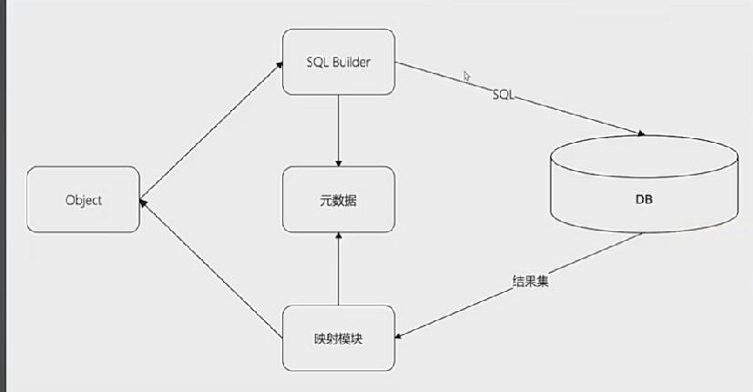
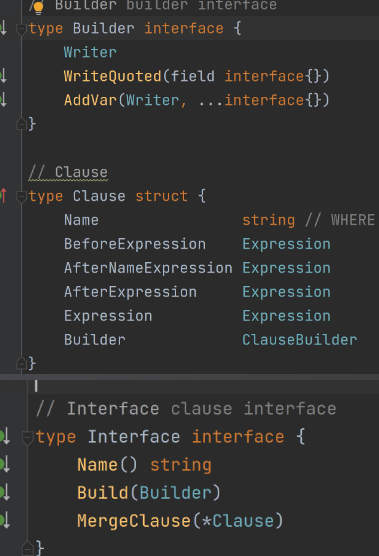
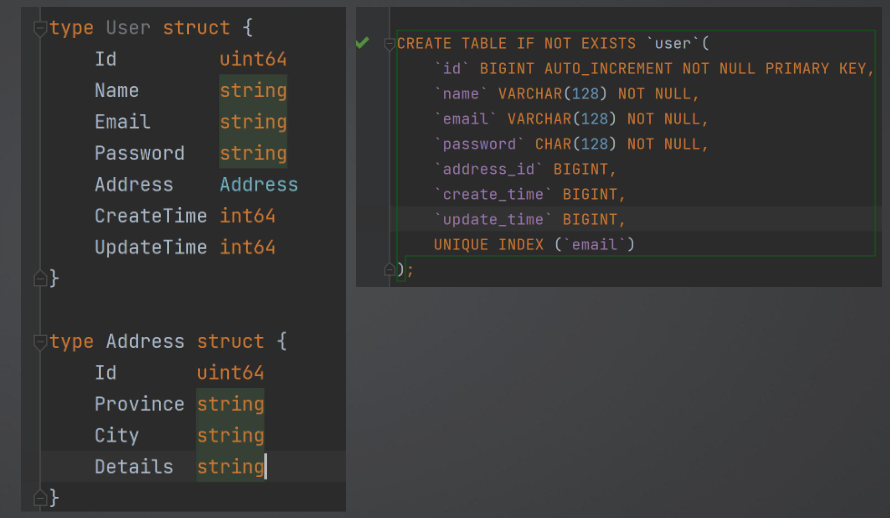
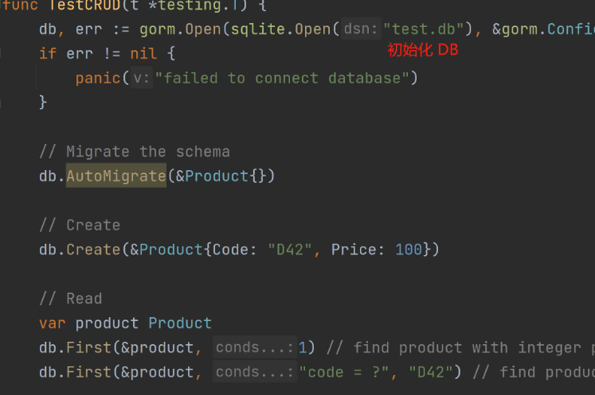

# go-actions


## orm框架

为什么要有orm?

 1. 手写sql易错，难重构
 2. 手动处理结果集，重复性工作太多，与业务逻辑无关，效率低下

将结构体信息映射到数据库表,结果集映射到对象



* SQL：必须要支持的就是增删改查，DDL 一般是作为一个扩展功能，或者作为一个工具来提供。
* 映射：将结果集封装成对象，性能瓶颈。
* 事务：主要在于维护好事务状态。
* 元数据：SQL 和映射两个部分的基石。
* AOP：处理横向关注点。
* 关联关系：部分 ORM 框架会提供，性价比低。
* 方言：兼容不同的数据库，至少要兼容 MySQL、
* SQLite、 PostgreSQL。
* 其它：......


gorm通过build模式层层封装

  * Builder：提供了最基本的构造方法
  * Expression：表达式，表达式和表达式可以组合成复合表
    达式
  * Clause：按照特定需要组合而成的 SQL 的一个部分
  * Interface：构造它自身，以及和其它部分 Clause 组合

  SQL 的不同部分分开构造，再组合在一起


## ent

ent通过代码生成器，自动生成代码


## 问题思考

 假如现在有个需求，需要实现一个orm，该如何实现？

### 需求分析

#### 目的

 orm解决的问题是将结构体映射到数据库表，将结果集映射到对象，满足业务快速开发，提高开发效率
 

#### 功能需求

 1. 增删改查 (基本功能,带条件或者不带条件)

   select语句如何映射?
   过滤条件如何映射?
   如何构造最终送到数据库的sql？

 * 用户如何使用？
      需要先想清楚如何使用orm，才能知道如何设计orm

      用户一般使用时，先定义一个结构体，然后定义一个表，将结构体与表关联起来，类似下图
      

      orm对用户提供的接口应该简单便捷，需要少。接口至少能和sql语句的关键词进行对应，便于使用。

 * 用户输入一个对象时，能产生对应sql, 数据库返回时，能组装成对象

      对象到sql的映射,必定是build模式,分步构造,最终组装成sql

      sql有俩大类，dml和ddl，我们主要关注dml，dml有select,insert,update,delete,ddl有create,drop,alter等，我们主要关注select,insert,update,delete。

      dml中，基础语句后面，往往带有过滤条件需要处理，结果集映射，分页，排序等，select相对较为复杂，需要先从select开始

      增删改查，进一步抽象为俩类行为：查询与写入执行，select属于查询，其他都为写入操作。

      需要处理的输入分别是:字段和值，以及对应的操作。具体抽象操作，查询，写入，过滤，排序和分页也属于特殊的操作，单列举出来。

      查询接口根据结果，分为俩类：单条记录和多条记录，单条记录返回对象，多条记录返回对象列表。


##### 提取上述思考的有效约束

    * 易用
    * 灵活


 2. 事务  (基本功能)
 3. 元数据 (sql与映射结构体的关键)
 4. AOP (基本功能, 处理横向关注点，比如需要灵活增加缓存，日志，监控等)
 5. 方言(方便对接不同数据库)

#### 非功能性需求
 1. 需要灵活扩展, 支持不同类型的sql构建需求
 2. 约束性需要尽可能少
 
### 设计思路

1. 顶层查询设计分为两种，获取单个结果，获取列表结果

```go
 // 查询器
 type Querier[T any] interface {
     Get(context.Context)(*T, error)
     List(context.Context) ([]*T, error)
 }
```

由于写入操作包含不同的类型，接口定义时，定义为执行器

```go
 // 执行器
 type Executor interface {
     Exec(context.Context) (sql.Result, error)
 }
```

sql构建器
```go
 type Query struct {
     Sql  string
     Args []any
 }

 type QueryBuilder interface {
     Build()(*Query, error)
 }
```

2. 在顶层基础上，针对增删改查进行设计

 * select的抽象-选择器
    ```go
    type Selector[T any] struct { // 此处泛型定义查询结果返回
        db *sql.DB
    }

    func NewSelector[T any]() *Selector[T] {
        return &Selector[T]{}
    }
    ```

    使用时,示例如下
    ```go
    
    // 示例一: 自定义表名
    NewSelector[User]().From("user").Where(Condition{
        Field: "name",
        Operator: "=",
        Value: "zhangsan",
    }).Get(context.Background())

    // 示例二：默认使用User首字母小写后的表
    NewSelector[User]().Where(Condition{
        Field: "name",
        Operator: "=",
        Value: "zhangsan",
    }).List(context.Background())
    ```

    其他方法定义如下
    ```go
    func (s *Selector[T]) From(table string) *Selector[T] {
      return s
    }

    // 支持链式调用
    func (s *Selector[T]) Where(ps ...Condition) *Selector[T] { 
        return s
    }

    func (s *Selector[T]) Build() (*Query, error) {
        return nil, nil
    }

    func (s *Selector[T]) Get(ctx context.Context) (*T, error) {
        q, err := s.Build()
        if err != nil {
            return nil, err
        }

        // 借助sql的抽象接口，执行查询
        rows, err := s.db.QueryContext(ctx, q.Sql, q.Args...)
        if err != nil {
            return nil, err
        }
        // 处理结果集
        return nil, nil
    }

    func (s *Selector[T]) List(ctx context.Context) ([]*T, error) {
        return nil, nil
    }
    ```

 * insert的抽象-插入器
    ```go
    type Inserter[T any] struct {
        db *sql.DB
    }

    func NewInserter[T any]() *Inserter[T] {
        return &Inserter[T]{}
    }

    func (i *Inserter[T])Build() (*Query, error) {
        return nil, nil
    }

    func (i *Inserter[T]) Exec(ctx context.Context) (sql.Result, error) {
        q, err:= i.Build()
        if err != nil {
            return nil, err
        }
        return i.db.ExecContext(ctx, q.Sql, q.Args...)
    }
    ```

 * update的抽象-更新器
    ```go
    type Updater[T any] struct {
        db *sql.DB
    }

    func NewUpdater[T any]() *Updater[T] {
        return &Updater[T]{}
    }

    func (u *Updater[T])Build() (*Query, error) {
        return nil, nil
    }

    func (u *Updater[T]) Exec(ctx context.Context) (sql.Result, error) {
        q, err:= u.Build()
        if err != nil {
            return nil, err
        }
        return u.db.ExecContext(ctx, q.Sql, q.Args...)
    }
    ```

 * delete的抽象-删除器
    ```go
    type Deleter[T any] struct {
        db *sql.DB
    }

    func NewDeleter[T any]() *Deleter[T] {
        return &Deleter[T]{}
    }

    func (d *Deleter[T])Build() (*Query, error) {
        return nil, nil
    }

    func (d *Deleter[T]) Exec(ctx context.Context) (sql.Result, error) {
        q, err:= d.Build()
        if err != nil {
            return nil, err
        }
        return d.db.ExecContext(ctx, q.Sql, q.Args...)
    }
    ```

3. 针对查询过滤条件进行设计
  
   过滤条件从sql的表达式来看，
      1. 可以拆分为字段、操作符、值, 操作符包含基本的算术操作，如等于、不等于、大于、小于、大于等于、小于等于等。
      2. 左边为字段，右边为值，值可以是常量，也可以是变量。
      3. 操作符和值之间用空格隔开。
      4. 多个条件之间用and或or连接。
      
    因此，过滤条件包含以下结构
     * 基础表达式
     * 组合表达式

    表达式，既可以是字段，也可以是一个表达式的组合，亦可以是值
    ```go
    type Operator string

    const (
        OpEq Operator = "="
        OpNe Operator = "!="
        OpGt Operator = ">"
        OpLt Operator = "<"
        OpGe Operator = ">="
        OpLe Operator = "<="
        OpIn Operator = "in"
        OpNotIn Operator = "not in"
        OpLike Operator = "like"
        // 其他
        OpNOT = "not"
        OpAND = "and"
        OpOR = "or"
    )

    type Expression interface {
    }

    type Condition struct {
        left Expression
        operator Operator
        right Expression
    }
    ```

#### 基于表达式，包含字段，值，操作符

   * 定义字段
    ```go
    type Field struct {
        name string
    }

    func (f *Field) String() string {
        return f.name
    }

    // F("id").Eq(1).And(F("name").Like("abc%"))
    func F(name string) *Field {
        return &Field{name: name}
    }

    func (f *Field) Eq(value any) *Condition {
        return &Condition{
            left: f,
            operator: OpEq,
            right: NewValue(value),
        }
    }
    ```

   * 定义值
    ```go
    type Value struct {
        value any
    }

    func NewValue(value any) *Value {
        return &Value{value: value}
    }

    func (v *Value) String() string {
        return fmt.Sprintf("%v", v.value)
    }
    ```
#### 逻辑表达式，左右都是表达式，操作符是and或or，not

   ```go
   func (c *Condition) And(right Condition) *Condition {
        return &Condition{
            left: c,
            operator: OpAND,
            right: right,
        }
    }

    func (c *Condition) Or(right Condition) *Condition {
        return &Condition{
            left: c,
            operator: OpOR,
            right: right,
        }
    }

    func Not(c *Condition) *Condition {
        return &Condition{
            left: nil,
            operator: OpNOT,
            right: c,
        }
    }
    ```

    定义where时，传入Condition列表

#### 思考：
    对输入要不要校验？还是依赖数据库进行校验？
    接下里需要进行结果转为为对象，如何设计？


